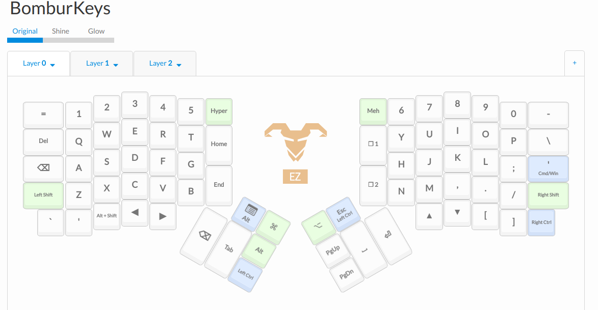
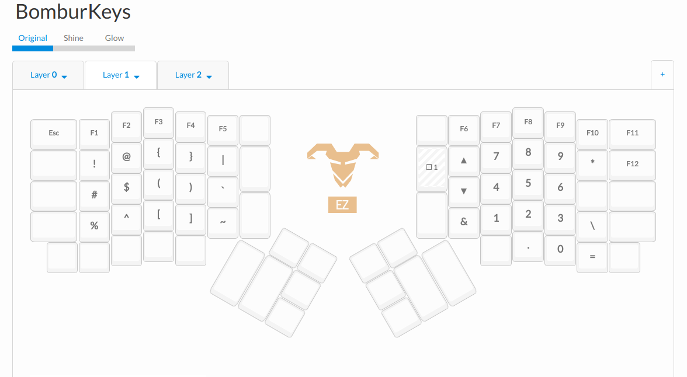
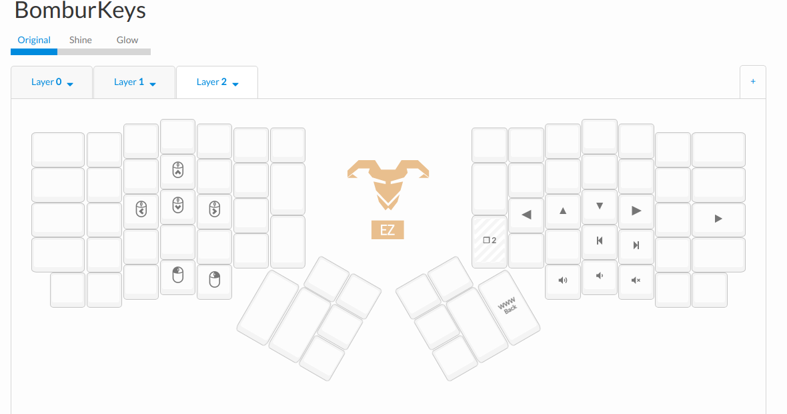

### BomburKeys layout

My own custom layout for ErgoDox Original using the QMK firmware

Below are some screenshots of the layout:

#### Layer 0 - Out of Date (see keymap.c for actual mapping)

#### Layer 1

#### Layer 2

